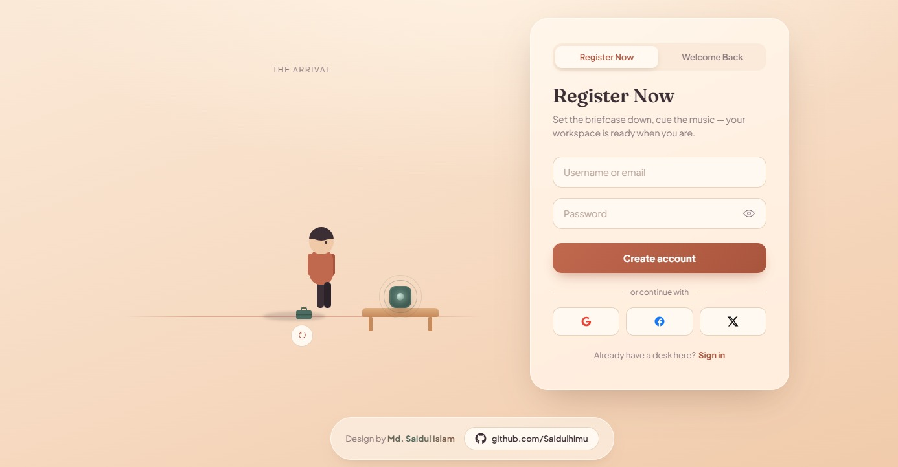

# 🌅 Golden Hour — Animated Login & Register Page

[](https://saidul-dev-mern.vercel.app)
[](https://developer.mozilla.org/en-US/docs/Web/HTML)
[](https://developer.mozilla.org/en-US/docs/Web/CSS)
[](https://developer.mozilla.org/en-US/docs/Web/JavaScript)

---

## 📌 Project Overview
A modern, aesthetic **Golden Hour** themed Login and Registration interface. This project features interactive UI sliding animations, smooth overlay transitions between Sign In and Sign Up panels, responsive styling, and custom CSS gradients.

---

## 📷 UI Preview


---

## ✨ Key Features
- 🔄 **Smooth Overlay Transition:** Interactive sliding panel toggle between Sign In and Sign Up forms.
- 🎨 **Golden Hour Aesthetic:** Custom vibrant CSS gradient styling, modern dark/golden accents, and sleek typography.
- 📱 **Fully Responsive:** Smoothly adapts across mobile, tablet, and desktop screens.
- 🔒 **Interactive Form Components:** Styled input fields, button hover states, and social login triggers.
- ⚡ **Lightweight & Fast:** Pure Vanilla JavaScript without heavy external frameworks.

---

## 🛠️ Tech Stack
- **HTML5:** Semantic markup layout and structure
- **CSS3:** Custom keyframe animations, Flexbox layout, CSS variables, and responsive media queries
- **JavaScript (ES6+):** DOM manipulation and event handlers for panel toggling

---

## 📦 Dependencies
- **Zero Heavy Dependencies:** Built completely with pure Vanilla HTML5, CSS3, and JavaScript.
- **Font Awesome CDN:** Used for modern social media icons.

---

## 🚀 How to Run Locally

Follow these simple steps to run this project on your local machine:

1. **Clone the Repository:**
   ```bash
   git clone [https://github.com/Saidulhimu/animated-login-register-page.git](https://github.com/Saidulhimu/animated-login-register-page.git)
